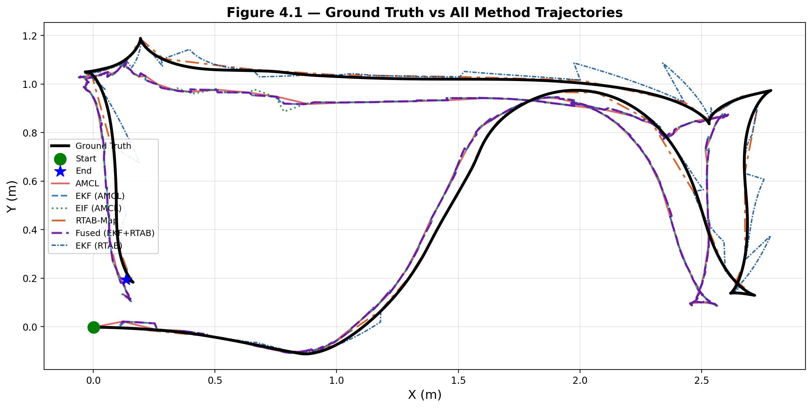
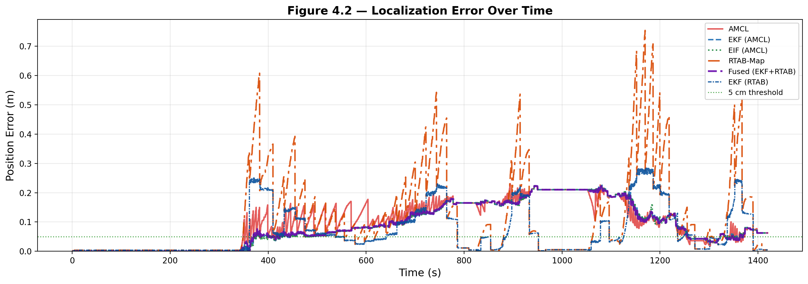
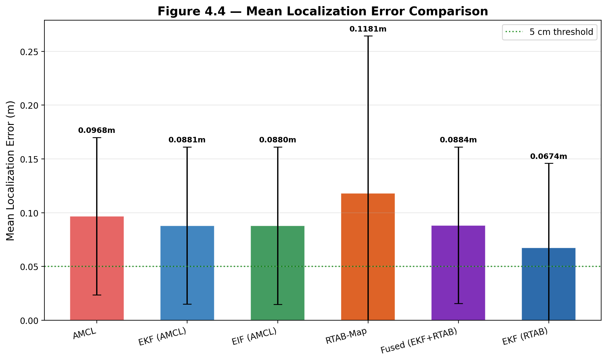
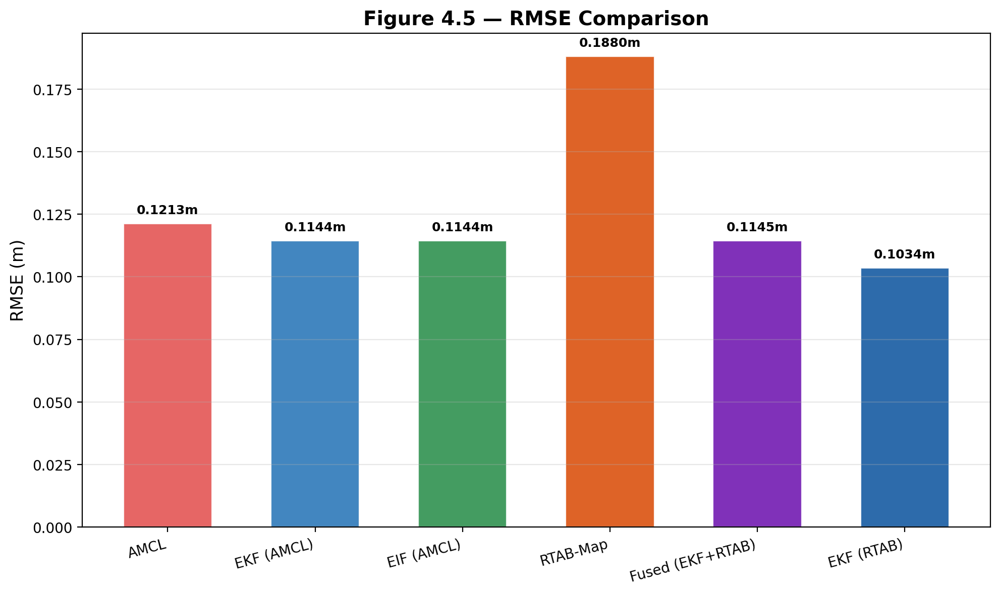
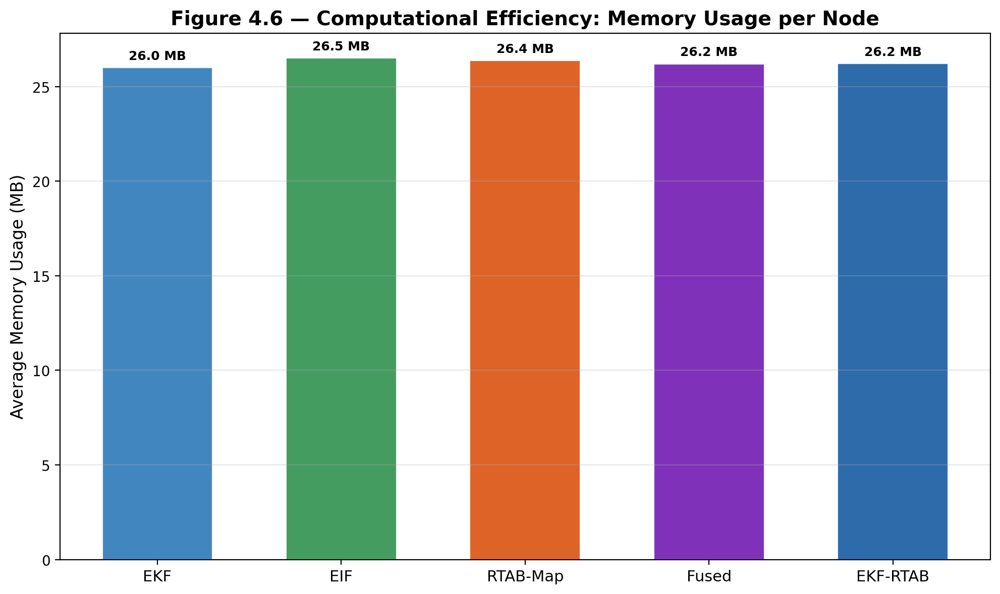
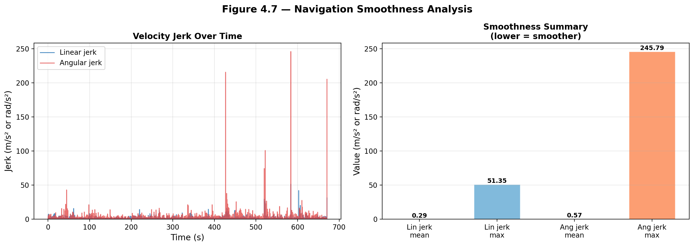

# Hybrid SLAM Localization for Dynamic Environments

<p align="center">
  
</p>

<p align="center">
  
  
  
  
  
</p>

---

> **MSc Thesis** — *Development of a SLAM Algorithm for Dynamic Environments Using Sensor Information Fusion*  

> **ITMO University · 2026**<br>

> **Supervisor:** Krasnov Alexander Yurievich<br>

> **Author:** Emmanuel Israel Okpara · godswille45@gmail.com

---

## Overview

This repository implements and experimentally validates a **hybrid localization framework** that fuses Extended Kalman Filter (EKF) and Extended Information Filter (EIF) sensor fusion with RTAB-Map factor graph SLAM for improved robustness in dynamic environments.

Six localization methods are compared simultaneously in a Gazebo simulation with a TurtleBot3 Waffle Pi navigating a closed rectangular loop while a dynamic obstacle is introduced mid-path:

| Method | Description | Node |
|---|---|---|
| **AMCL** | Adaptive Monte Carlo Localization — baseline | Nav2 built-in |
| **EKF (AMCL)** | EKF with odometry predict + AMCL correct | `ekf_node` |
| **EIF (AMCL)** | Information filter dual of EKF | `eif_node` |
| **RTAB-Map** | LiDAR factor graph SLAM | `rtabmap_slam` |
| **Fused (EKF+RTAB)** | EKF with loop-closure-gated RTAB-Map correction | `fusion_node` |
| **EKF (RTAB)** | EKF corrected by RTAB-Map instead of AMCL | `ekf_rtab_node` |

All methods run simultaneously against a Gazebo ground truth, enabling direct per-timestamp comparison.

---

## Key Results — 10-Iteration Experiment

| Method | Avg Error | Max Error | RMSE | vs AMCL |
|---|---|---|---|---|
| AMCL | 0.1457 ± 0.0152 m | 0.2517 m | 0.1559 m | baseline |
| EKF (AMCL) | 0.1354 ± 0.0214 m | 0.2061 m | 0.1432 m | −7.1% |
| EIF (AMCL) | 0.1358 ± 0.0201 m | 0.2054 m | 0.1437 m | −6.8% |
| Fused (EKF+RTAB) | 0.1357 ± 0.0208 m | 0.2047 m | 0.1434 m | −6.9% |
| EKF (RTAB) | 0.1597 ± 0.0175 m | 0.3102 m | 0.1826 m | +9.6% |
| RTAB-Map | 0.2910 ± 0.0362 m | 0.7061 m | 0.3423 m | +99.7% |

**Navigation smoothness:** Linear jerk mean 0.6091 m/s² · Angular jerk mean 1.2354 rad/s²

**Memory usage:** All nodes operate within **26–27 MB RAM** with negligible CPU overhead.

---

## Thesis Figures

<table>
  <tr>
    <td align="center">
      <b>Fig 4.1 — Trajectory Comparison</b><br/>
      
    </td>
    <td align="center">
      <b>Fig 4.2 — Error Over Time</b><br/>
      
    </td>
  </tr>
  <tr>
    <td align="center">
      <b>Fig 4.4 — Mean Localization Error</b><br/>
      
    </td>
    <td align="center">
      <b>Fig 4.5 — RMSE Comparison</b><br/>
      
    </td>
  </tr>
  <tr>
    <td align="center">
      <b>Fig 4.6 — Memory Usage per Node</b><br/>
      
    </td>
    <td align="center">
      <b>Fig 4.7 — Navigation Smoothness</b><br/>
      
    </td>
  </tr>
</table>

---

## Repository Structure

```
Hybrid-SLAM-Localization-ROS2/
├── docker/
│   └── Dockerfile
├── models/
│   └── gazebo_models/
│       └── box_target_red/
├── results/
│   └── data/
├── ros_ws/
│   └── src/
│       ├── hybrid_localization_pkg/
│           ├── hybrid_localization_pkg/
│           │   └── nodes/
│           │       ├── ekf_node.py
│           │       ├── eif_node.py
│           │       ├── ekf_rtab_node.py
│           │       ├── fusion_node.py
│           │       ├── rtabmap_pose_bridge.py
│           │       ├── ground_truth_publisher.py
│           │       ├── plotter.py
│           │       ├── resource_monitor.py
│           │       └── smoothness_monitor.py
│           ├── config/
│           │   └── nav2_params.yaml
│           ├── maps/
│           │   ├── my_map.yaml
│           │   └── my_map.pgm
│           ├── launch/
│           │   ├── custom_world_nav2.launch.py
│           │   ├── my_world.launch.py
│           │   └── rtabmap.launch.py
│           └── worlds/
│               └── turtlebot3_world.world
└── README.md
```

---

## System Architecture

```
Sensors
/odom         ──────────────────────► EKF predict (50 Hz)
/amcl_pose    ─────────────────────► EKF update  ──────────► /ekf_pose ──► map→odom TF
/scan         ──────────────────────► RTAB-Map
                                          │
                                 /localization_pose
                                 rtabmap_pose_bridge
                                 /rtabmap_pose (Odometry)
                                          ├──► ekf_rtab_node ──► /ekf_rtab_pose
                                          └──► fusion_node   ──► /fused_pose
                                                                     ▲
                                                                 /ekf_pose
/odom         ──────────────────────► eif_node ────────────► /eif_pose

/odometry/true_pose (Gazebo world frame) ──► ground_truth_publisher
                                                      │
                                           GT offset calibration
                                                      │
                                           thesis_plotter ──► Figures 4.1–4.7
```

---

## Algorithm Details

### EKF (Extended Kalman Filter)

State vector: `x = [x, y, θ]ᵀ` in map frame

**Prediction** (odometry motion model at 50 Hz):

```
x̂ₖ = f(xₖ₋₁, uₖ) = [x + v·cos(θ)·dt, y + v·sin(θ)·dt, θ + ω·dt]ᵀ
Pₖ = Fₖ·Pₖ₋₁·Fₖᵀ + Q
```

**Update** (AMCL measurement):

```
K = P·Hᵀ·(H·P·Hᵀ + R)⁻¹
x = x̂ + K·(z − H·x̂)
P = (I − K·H)·P·(I − K·H)ᵀ + K·R·Kᵀ  [Joseph form — numerically stable]
```

### EIF (Extended Information Filter)

Information matrix `Ω = P⁻¹` and information vector `ξ = Ω·x`

**Update is purely additive** — key advantage over EKF for multi-sensor fusion:

```
Ω_new = Ω_pred + Hᵀ·R⁻¹·H
ξ_new = ξ_pred + Hᵀ·R⁻¹·z
```

Experimentally confirmed equivalent to EKF (Δ = 0.0001 m over 10 iterations).

### Fusion Node

Normal operation: `/fused_pose` = `/ekf_pose` (pass-through)

On loop closure detection:

```
fused_x = (1 − α)·ekf_x + α·rtab_x
fused_y = (1 − α)·ekf_y + α·rtab_y
α = 0.7
fused_θ = ekf_θ + α·wrap(rtab_θ − ekf_θ)
```

Corrections are gated by: loop closure detection, maximum distance threshold, and RTAB-Map data freshness (staleness < 2s).

---

## Quickstart with Docker

### Prerequisites

- [Docker Desktop](https://www.docker.com/products/docker-desktop/) installed
- [VcXsrv](https://sourceforge.net/projects/vcxsrv/) or [X410](https://x410.app/) running on Windows for GUI display

### 1 — Clone the repository

```bash
git clone https://github.com/YOUR_USERNAME/Hybrid-SLAM-Localization-ROS2.git
cd Hybrid-SLAM-Localization-ROS2
```

### 2 — Build the Docker image

```bash
docker build -t tech_project ./docker
```

### 3 — Run the container
## Navigate into the `Hybrid-SLAM-Localization-ROS2` directory you pulled and run the below 

```bash
docker run -it --rm \
  --env DISPLAY=host.docker.internal:0 \
  -v "$(pwd)":/ros_ws \
  tech_project
```

### 4 — Build the ROS2 workspace (first time only)

```bash
cd /ros_ws/ros_ws
source /opt/ros/jazzy/setup.bash
colcon build --packages-select \
  hybrid_localization_pkg \
  cmd_vel_bridge \
  --symlink-install
source install/setup.bash
export TURTLEBOT3_MODEL=waffle_pi
```

---

## Running the Full Experiment

Open 13 terminals, each running the container with the same volume mount. In each terminal run `source /opt/ros/jazzy/setup.bash && source /ros_ws/ros_ws/install/setup.bash && export TURTLEBOT3_MODEL=waffle_pi` first.

```bash
# Terminal 1 — Change the cmd to Twist instead of TwistStamped
cp /ros_ws/turtlebot3_waffle_pi_bridge.yaml /opt/ros/jazzy/share/turtlebot3_gazebo/params/turtlebot3_waffle_pi_bridge.yaml
# Terminal 1 — Gazebo simulation
ros2 launch turtlebot3_gazebo turtlebot3_world.launch.py use_sim_time:=true

# Terminal 2 — Nav2 with AMCL
ros2 launch nav2_bringup bringup_launch.py \
  map:=/opt/ros/jazzy/share/turtlebot3_navigation2/map/map.yaml \
  params_file:=/ros_ws/ros_ws/src/hybrid_localization_pkg/config/nav2_params.yaml \
  use_sim_time:=true autostart:=true

# Terminal 3 — Ground truth publisher
ros2 run hybrid_localization_pkg ground_truth_publisher

# Terminal 4 — EKF node (wait for "EKF initialised from AMCL")
ros2 run hybrid_localization_pkg ekf_node

# Terminal 5 — EIF node
ros2 run hybrid_localization_pkg eif_node

# Terminal 6 — RTAB-Map
ros2 run rtabmap_slam rtabmap \
  --ros-args --params-file /tmp/rtabmap_params.yaml \
  --remap scan:=/scan --remap odom:=/odom

# Terminal 7 — Set RTAB-Map to localization mode (5s after Terminal 6)
ros2 service call /rtabmap/set_mode_localization std_srvs/srv/Empty {}

# Terminal 8 — RTAB-Map pose bridge
ros2 run hybrid_localization_pkg rtabmap_pose_bridge

# Terminal 9 — EKF with RTAB-Map correction
ros2 run hybrid_localization_pkg ekf_rtab_node

# Terminal 10 — Fusion node
ros2 run hybrid_localization_pkg fusion_node

# Terminal 11 — Thesis plotter (saves Figs 4.1–4.7 on Ctrl+C)
ros2 run hybrid_localization_pkg plotter

# Terminal 12 — Set initial pose
ros2 topic pub -1 /initialpose geometry_msgs/msg/PoseWithCovarianceStamped "{
  header: {frame_id: map},
  pose: {pose: {position: {x: 0.0, y: 0.0, z: 0.0},
  orientation: {w: 1.0}},
  covariance: [0.25,0,0,0,0,0, 0,0.25,0,0,0,0, 0,0,0,0,0,0,
               0,0,0,0,0,0, 0,0,0,0,0,0, 0,0,0,0,0,0]}}"

# Terminal 13 — 
ros2 action send_goal /navigate_to_pose nav2_msgs/action/NavigateToPose \ "{pose: {header: {frame_id: map}, pose: {position: {x: 2.5, y: 0.0, z: 0.0}, orientation: {w: 1.0}}}}" 

# Once the robot starts moving, after 5 seconds spawn the obstacle in terminal 14 

# Terminal 14 — 
ros2 run ros_gz_sim create \ -name experiment_obstacle \ -file /ros_ws/models/gazebo_models/box_target_red/model.sdf \ -x 0.0 -y -0.5 -z 0.1 

# Once the robot gets to the goal point, you will get a SUCCESS report in terminal 13. Next
# Move the robot to the next goal point in terminal 13
# Terminal 13 - 
ros2 action send_goal /navigate_to_pose nav2_msgs/action/NavigateToPose \ "{pose: {header: {frame_id: map}, pose: {position: {x: 2.5, y: 1.0, z: 0.0}, orientation: {w: 1.0}}}}" 
# Terminal 13 - 
ros2 action send_goal /navigate_to_pose nav2_msgs/action/NavigateToPose \ "{pose: {header: {frame_id: map}, pose: {position: {x: 0.0, y: 1.0, z: 0.0}, orientation: {w: 1.0}}}}" 
# Terminal 13 - 
ros2 action send_goal /navigate_to_pose nav2_msgs/action/NavigateToPose \ "{pose: {header: {frame_id: map}, pose: {position: {x: 0.0, y: 0.0, z: 0.0}, orientation: {w: 1.0}}}}" 
```

When all iterations complete, press **Ctrl+C** on Terminal 11 to save all figures.

```bash
# Kill all processes
pkill -f 'gz sim|ros2 run|ros2 launch|rtabmap|rviz2|hybrid_localization' 2>/dev/null
```

---

## Package Descriptions

### hybrid_localization_pkg — Main thesis package

| Node | Purpose |
|---|---|
| `ekf_node` | EKF with odometry prediction and AMCL correction. Publishes map→odom TF consumed by Nav2 |
| `eif_node` | Information filter formulation of EKF. Update step is purely additive |
| `ekf_rtab_node` | EKF architecture with RTAB-Map as correction source instead of AMCL |
| `fusion_node` | Passes EKF pose normally; applies RTAB-Map correction only at loop closure |
| `rtabmap_pose_bridge` | Converts /localization_pose (PoseWithCovarianceStamped) to /rtabmap_pose (Odometry) |
| `ground_truth_publisher` | Reads Gazebo world frame and publishes /odometry/true_pose |
| `plotter` | Records all 6 method trajectories and generates thesis Figures 4.1–4.7 |
| `resource_monitor` | Samples CPU and memory of all localization nodes via psutil |
| `smoothness_monitor` | Computes velocity jerk from /cmd_vel_nav as navigation smoothness metric |


---

## ROS2 Topics

| Topic | Type | Description |
|---|---|---|
| `/ekf_pose` | nav_msgs/Odometry | EKF estimate in map frame |
| `/eif_pose` | nav_msgs/Odometry | EIF estimate in map frame |
| `/ekf_rtab_pose` | nav_msgs/Odometry | EKF-RTAB estimate in map frame |
| `/fused_pose` | nav_msgs/Odometry | Fused EKF+RTAB estimate |
| `/rtabmap_pose` | nav_msgs/Odometry | RTAB-Map pose (bridged) |
| `/amcl_pose` | geometry_msgs/PoseWithCovarianceStamped | AMCL particle filter estimate |
| `/odometry/true_pose` | nav_msgs/Odometry | Gazebo ground truth |
| `/obstacle_spawned_first` | std_msgs/Float64 | Timestamp of obstacle spawn event |
| `/cmd_vel_nav` | geometry_msgs/Twist | Nav2 velocity commands |

---

## Nav2 Parameter Tuning

```yaml
controller_server:
  ros__parameters:
    controller_frequency: 10.0

local_costmap:
  ros__parameters:
    inflation_layer:
      inflation_radius: 0.25

controller_server:
  ros__parameters:
    FollowPath:
      rotate_to_heading_min_angle: 0.785
      yaw_goal_tolerance: 0.5
```

---

## Future Work

- Real-world deployment on physical TurtleBot3 hardware with RTK-GPS ground truth
- Adaptive fusion weights — information-theoretic α based on relative covariances
- Camera-based RTAB-Map — visual features for more robust loop closure detection
- Multi-robot extension — EIF additive update is naturally suited to distributed fusion
- 3D environments — extend to 3D state space with IMU integration
- Deep learning integration — learned dynamic object masks to filter moving objects from LiDAR scans

---

## Citation

```bibtex
@mastersthesis{okpara2026hybrid,
  title  = Development of a SLAM Algorithm for Dynamic Environments Using Sensor Information Fusion,
  author = Emmanuel Israel Okpara,
  school = ITMO University,
  year   = 2026,
  note   = Available at: https://github.com/YOUR_USERNAME/Hybrid-SLAM-Localization-ROS2
}
```

---

## License

MIT License — see LICENSE for details.

---

## Contact

**Emmanuel Israel Okpara**<br>
MSc Graduate · **ITMO University · 2026**<br>
📧 [Email](mailto:godswille45@gmail.com) · [GitHub](https://github.com/godswill12) · [LinkedIn](https://www.linkedin.com/in/israel-emmanuel-387567163/)
